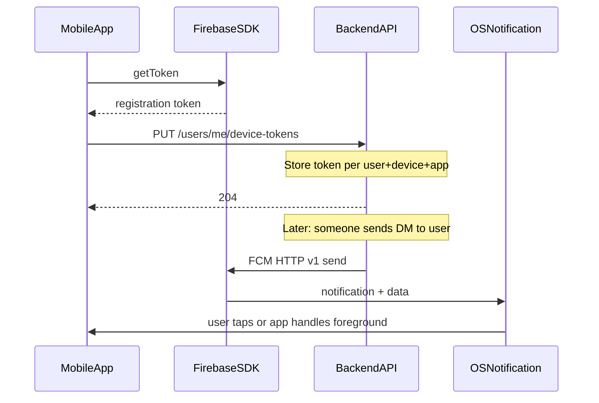

# Push Notifications — Client Implementation Guide

This guide explains how **Attendee** and **Organizer** mobile apps should register FCM device tokens with the API and handle incoming push notifications.

Push complements in-app **WebSocket** delivery. It is used when the app is backgrounded or killed. The server sends push to the **recipient** only (not the sender). The sender still receives DM sync over WebSocket on their other devices.

**Related docs**

- REST details: Swagger (`/swagger/`) — tag `users` for device token endpoints; tag `events` for organizer announcements (`POST/GET /events/{eventID}/announcements`)
- Event chat (DM payloads, `conversation_id`, WS dedupe): [event-chat-client-guide.md](./event-chat-client-guide.md)
- Event sponsors (attendee browse, engagement): [sponsors-client-guide.md](./sponsors-client-guide.md)
- WebSocket architecture: [agenda-realtime-websocket-architecture.md](./agenda-realtime-websocket-architecture.md)
- Push + WebSocket schemas: `GET /ws/asyncapi.json` (FCM payloads under `components.x-pushNotifications`)

---

## Overview

| Concern | Mechanism |
|--------|-----------|
| Obtain FCM token | Firebase SDK on device (`getToken()` / `onTokenRefresh`) |
| Register token with API | `PUT /users/me/device-tokens` (authenticated) |
| Unregister on logout | `DELETE /users/me/device-tokens` |
| Receive notification | FCM → OS notification tray (title + body) |
| Deep link / in-app routing | FCM `data` payload (`type` + IDs) |
| Live in-app updates | WebSocket (see event chat guide) |



---

## Prerequisites

1. **Firebase project** — Attendee and Organizer apps registered in the same Firebase project (Android package names / iOS bundle IDs configured).
2. **FCM SDK integrated** — `google-services.json` (Android) and `GoogleService-Info.plist` (iOS).
3. **iOS only** — APNs authentication key uploaded in Firebase Console (Project settings → Cloud Messaging).
4. **User logged in** — JWT available for API calls.
5. **Notification permission** — Request on iOS; Android 13+ needs `POST_NOTIFICATIONS`.

The backend must have `PUSH_PROVIDER=fcm` and valid server credentials. In development it may run with `noop` (no real pushes).

---

## Device identity (`device_id`)

Generate a **stable client-side ID** per app install:

- Create a UUID on first launch.
- Persist in secure storage / shared preferences / Keychain.
- Reuse for all token registrations from that install.
- Generate a **new** ID only on fresh install (or explicit “reset device”).

The backend keys tokens by `(user_id, device_id, app)`. One user can have **multiple devices** (phone + tablet); each registers separately and **all** receive push when they are the DM recipient.

---

## Register device token

### Request

```
PUT /users/me/device-tokens
Authorization: Bearer <JWT>
Content-Type: application/json
```

```json
{
  "token": "<fcm-registration-token>",
  "device_id": "<stable-client-uuid>",
  "platform": "android",
  "app": "attendee"
}
```

| Field | Required | Values | Notes |
|-------|----------|--------|-------|
| `token` | yes | FCM registration token string | From Firebase SDK |
| `device_id` | yes | max 128 chars | Stable per install (see above) |
| `platform` | yes | `android`, `ios` | Lowercase |
| `app` | yes | `attendee`, `organizer` | Which app is calling |

### Response

| Status | Meaning |
|--------|---------|
| `204` | Token upserted (success body: `{ "data": null, "error": null }`) |
| `400` | Validation error (`invalid_request_body`) |
| `401` | Missing or invalid JWT |
| `404` | User not found |
| `500` | Server error |

### When to call

| Event | Action |
|-------|--------|
| After successful login | `PUT` with current FCM token |
| App startup (session valid) | `PUT` (refresh registration) |
| FCM `onTokenRefresh` | `PUT` with new token |
| User grants notification permission | `PUT` once token is available |

Registration is **idempotent**: repeated `PUT` for the same `device_id` + `app` updates the stored token.

---

## Unregister device token

Call on **logout** so the device stops receiving push for that user.

```
DELETE /users/me/device-tokens
Authorization: Bearer <JWT>
Content-Type: application/json
```

```json
{
  "device_id": "<stable-client-uuid>",
  "app": "attendee"
}
```

| Status | Meaning |
|--------|---------|
| `204` | Token removed (or already absent) |
| `400` | Validation error |
| `401` | Unauthorized |

---

## Multi-device behavior

- User logs in on **phone** and **tablet** → two `PUT` calls with different `device_id` values.
- When someone sends a DM to that user, **both** devices receive a push (if both tokens are registered).
- **Sender** does **not** receive push for messages they sent; sender devices get the message via WebSocket inbox sync instead.
- Logging out on one device should only `DELETE` that device’s `device_id`; other devices keep receiving push.

---

## Incoming message shape

The server sends FCM messages with both a **notification** (lock screen) and a **data** map (for app logic). All `data` values are strings.

### Notification (OS display)

| Field | Description |
|-------|-------------|
| `title` | Sender display name (`"First Last"`), or `"New message"` |
| `body` | Message text preview, truncated to ~100 characters |

The OS shows these when the app is backgrounded or killed.

### Data payload (app routing)

Every push includes a `data` object. Clients must read `data["type"]` to decide how to handle the notification.

---

## Notification type: `direct_message`

Sent when another attendee sends a **new** DM to the current user (not on idempotent resend of the same `client_msg_id`).

| `data` key | Description |
|------------|-------------|
| `type` | Always `"direct_message"` |
| `event_id` | Event UUID |
| `message_id` | Chat message UUID (dedupe key) |
| `conversation_id` | DM thread ID (`dm:{event_id}:{user_a}:{user_b}` — see event chat guide) |
| `sender_name` | Same as notification title |
| `sender_user_id` | Sender user UUID |

Example (data only):

```json
{
  "type": "direct_message",
  "event_id": "550e8400-e29b-41d4-a716-446655440000",
  "message_id": "6ba7b810-9dad-11d1-80b4-00c04fd430c8",
  "conversation_id": "dm:550e8400-e29b-41d4-a716-446655440000:aaaaaaaa-bbbb-cccc-dddd-eeeeeeeeeeee:ffffffff-1111-2222-3333-444444444444",
  "sender_name": "Ada Lovelace",
  "sender_user_id": "aaaaaaaa-bbbb-cccc-dddd-eeeeeeeeeeee"
}
```

### Recommended client handling

#### Background / killed

1. User taps notification.
2. Parse `data.type`.
3. For `direct_message`: navigate to DM thread for `event_id` + derive `recipient_user_id` from `conversation_id` and self `user_id` (or use `sender_user_id` as the other party).
4. Load thread history via REST if needed: `GET /attendee/events/{eventID}/chat/dm/{recipientUserID}/messages`.

#### Foreground

The app may already have the message via WebSocket (`chat.message` on DM inbox topic). **Dedupe by `message_id`**:

- If `message_id` already in local state → ignore push UI (optional: skip showing a banner).
- If not present → update inbox / open thread and optionally show in-app banner.

See [event-chat-client-guide.md](./event-chat-client-guide.md) for WebSocket subscribe topic:

```
attendee.chat.{event_id}.dm.inbox
```

---

## Notification type: `general_chat_reply`

Sent when another attendee posts a **new** general-chat reply to **your** message (`reply_to_message_id` points at a message you sent). Not sent for non-replies, self-replies, or idempotent resend of the same `client_msg_id`. Delivered only to devices registered with `app: "attendee"`.

| `data` key | Description |
|------------|-------------|
| `type` | Always `"general_chat_reply"` |
| `event_id` | Event UUID |
| `message_id` | Reply message UUID (dedupe key) |
| `reply_to_message_id` | Parent message UUID you authored |
| `sender_name` | Same as notification title (replier display name) |
| `sender_user_id` | Replier user UUID |

Example (data only):

```json
{
  "type": "general_chat_reply",
  "event_id": "550e8400-e29b-41d4-a716-446655440000",
  "message_id": "6ba7b810-9dad-11d1-80b4-00c04fd430c8",
  "reply_to_message_id": "550e8400-e29b-41d4-a716-446655440099",
  "sender_name": "Ada Lovelace",
  "sender_user_id": "aaaaaaaa-bbbb-cccc-dddd-eeeeeeeeeeee"
}
```

### Recommended client handling

#### Background / killed

1. User taps notification.
2. Parse `data.type`.
3. For `general_chat_reply`: navigate to event general chat for `event_id`.
4. Optionally scroll to or highlight `message_id` or `reply_to_message_id`.
5. Load history via REST if needed: `GET /attendee/events/{eventID}/chat/general/messages`.

#### Foreground

The app may already have the message via WebSocket (`chat.message` on general topic). **Dedupe by `message_id`**:

- If `message_id` already in local state → ignore push UI (optional: skip showing a banner).
- If not present → update general chat and optionally show in-app banner.

See [event-chat-client-guide.md](./event-chat-client-guide.md) for WebSocket subscribe topic:

```
attendee.chat.{event_id}.general
```

---

## Notification type: `organizer_chat_message`

Sent when another event manager posts a **new** message in the **backstage organizers chat**. Not sent on idempotent resend of the same `client_msg_id`. Delivered only to devices registered with `app: "organizer"`.

Recipients: event **owner** and **team members**, excluding the sender. The sender still receives the message on their other devices via WebSocket (`organizer.chat.{event_id}`).

| `data` key | Description |
|------------|-------------|
| `type` | Always `"organizer_chat_message"` |
| `event_id` | Event UUID |
| `message_id` | Message UUID (dedupe key) |
| `sender_name` | Same as notification title (sender display name) |
| `sender_user_id` | Sender user UUID |
| `reply_to_message_id` | Present when the message quotes a prior organizers message |

Example (data only):

```json
{
  "type": "organizer_chat_message",
  "event_id": "550e8400-e29b-41d4-a716-446655440000",
  "message_id": "6ba7b810-9dad-11d1-80b4-00c04fd430c8",
  "sender_name": "Ada Lovelace",
  "sender_user_id": "aaaaaaaa-bbbb-cccc-dddd-eeeeeeeeeeee",
  "reply_to_message_id": "550e8400-e29b-41d4-a716-446655440099"
}
```

### Recommended client handling

#### Background / killed

1. User taps notification.
2. Parse `data.type`.
3. For `organizer_chat_message`: navigate to backstage organizers chat for `event_id`.
4. Optionally scroll to or highlight `message_id` or `reply_to_message_id`.
5. Load history via REST if needed: `GET /events/{eventID}/chat/organizers/messages`.

#### Foreground

The app may already have the message via WebSocket (`chat.message` on organizers topic). **Dedupe by `message_id`**:

- If `message_id` already in local state → ignore push UI (optional: skip showing a banner).
- If not present → update backstage chat and optionally show in-app banner.

See [event-chat-client-guide.md](./event-chat-client-guide.md) for WebSocket subscribe topic:

```
organizer.chat.{event_id}
```

The **Organizer** app must register device tokens with `"app": "organizer"` (see [Register device token](#register-device-token)).

---

## Notification type: `event_announcement`

Sent when an event organizer broadcasts an announcement to **checked-in attendees**. Delivered only to devices registered with `app: "attendee"`.

| `data` key | Description |
|------------|-------------|
| `type` | Always `"event_announcement"` |
| `event_id` | Event UUID |
| `announcement_id` | Announcement UUID (dedupe key) |
| `action` | `info`, `open_event`, `open_session`, `open_agenda`, or `open_url` |
| `session_id` | Present when `action` is `open_session` |
| `url` | Present when `action` is `open_url` (https URL) |

> **Future: `open_sponsor` action (not in v1)**  
> A later release may add `action: "open_sponsor"` to organizer announcements so push can deep-link attendees into a sponsor profile. Expected additional `data` keys: `sponsor_id` (UUID). Clients should ignore unknown `action` values today. When shipped, update handling alongside [sponsors-client-guide.md](./sponsors-client-guide.md) and `GET /ws/asyncapi.json`.

### Recommended client handling

| `action` | Navigate to |
|----------|-------------|
| `info` | Show notification only (optional in-app announcement detail) |
| `open_event` | Event home for `event_id` |
| `open_session` | Session detail for `session_id` in `event_id` |
| `open_agenda` | Event agenda for `event_id` |
| `open_url` | In-app browser or external browser for `url` |

Dedupe by `announcement_id` if the user already saw the announcement in-app.

#### Android notes

- Data-only messages behave differently from notification+data; this API sends **both**.
- Use a `FirebaseMessagingService` subclass for `onMessageReceived`.
- When app is in foreground, you may need to show your own local notification if you want a banner.

#### iOS notes

- FCM delivers through APNs; ensure push capability and Firebase APNs key are configured.
- Foreground: implement `userNotificationCenter:willPresentNotification:` if you want banners while active.
- Tap handling: `userNotificationCenter:didReceiveNotificationResponse:` → read `userInfo` for data keys.

---

## Flutter reference flow (pseudo-code)

```dart
// 1. Stable device id (persist across launches)
final deviceId = await DeviceIdStore.getOrCreate();

// 2. After login
final fcmToken = await FirebaseMessaging.instance.getToken();
await api.put('/users/me/device-tokens', body: {
  'token': fcmToken,
  'device_id': deviceId,
  'platform': Platform.isIOS ? 'ios' : 'android',
  'app': 'attendee', // or 'organizer'
});

// 3. Token refresh
FirebaseMessaging.instance.onTokenRefresh.listen((token) async {
  if (!session.isLoggedIn) return;
  await api.put('/users/me/device-tokens', body: { ... });
});

// 4. Incoming message
FirebaseMessaging.onMessage.listen((message) {
  final type = message.data['type'];
  if (type == 'direct_message') {
    handleDirectMessagePush(message.data, foreground: true);
  }
});

FirebaseMessaging.onMessageOpenedApp.listen((message) {
  routeFromPushData(message.data);
});

// 5. Logout
await api.delete('/users/me/device-tokens', body: {
  'device_id': deviceId,
  'app': 'attendee',
});
```

---

## Error handling and retries

| Situation | Client action |
|-----------|---------------|
| `PUT` fails (network) | Retry with backoff; queue until success |
| `401` on `PUT` | Refresh session / re-login, then re-register |
| Invalid/expired FCM token | SDK fires refresh → `PUT` again |
| User disables notifications | Optional: skip `PUT` until re-enabled |

The server removes tokens that FCM reports as invalid; clients should always re-register after login.

---

## Current scope (v1)

| Feature | v1 behavior |
|---------|-------------|
| Notification types | `direct_message`, `general_chat_reply`, `organizer_chat_message`, `event_announcement` |
| Announcement `open_sponsor` deep link | **Not in v1** — planned; would navigate to sponsor detail via `sponsor_id` in push `data` |
| General chat push | Reply to your message only (parent author); not sent for every general message |
| Organizer backstage chat push | Every new backstage message to other managers (owner + team); organizer app tokens only |
| Organizer-specific push types | Organizer app receives `organizer_chat_message`; does not receive `event_announcement` (attendee app only) |
| Push for sender’s own messages | No — WebSocket only |
| Attachments / rich media in push | No — text preview only |

New `data.type` values may be added later. Clients should **ignore unknown types** safely (or show generic notification without deep link).

---

## Testing

1. Register token via `PUT` after login (confirm `204`).
2. Background the app on a **recipient** device.
3. From another user, send a DM in a shared event.
4. Recipient should receive OS notification with sender name + message preview.
5. Tap → app opens correct DM thread.
6. With app in foreground and WS connected, confirm no duplicate UI (dedupe `message_id`).
7. Logout → `DELETE` → send another DM → device should **not** receive push.

For local backend testing without Firebase, `PUSH_PROVIDER=noop` logs pushes server-side instead of delivering them.

---

## Quick reference

| Action | Method | Path |
|--------|--------|------|
| Register / refresh token | `PUT` | `/users/me/device-tokens` |
| Unregister token | `DELETE` | `/users/me/device-tokens` |

| `data.type` | Meaning |
|-------------|---------|
| `direct_message` | New DM in an event — use `event_id`, `conversation_id`, `message_id` |
| `general_chat_reply` | Reply to your general chat message — use `event_id`, `message_id`, `reply_to_message_id` |
| `organizer_chat_message` | New backstage organizers chat message — use `event_id`, `message_id`, optional `reply_to_message_id` |
| `event_announcement` | Organizer broadcast — use `event_id`, `announcement_id`, `action`, optional `session_id` / `url` |

Future `event_announcement` actions (not v1): `open_sponsor` with `sponsor_id` — see [sponsors-client-guide.md](./sponsors-client-guide.md).
